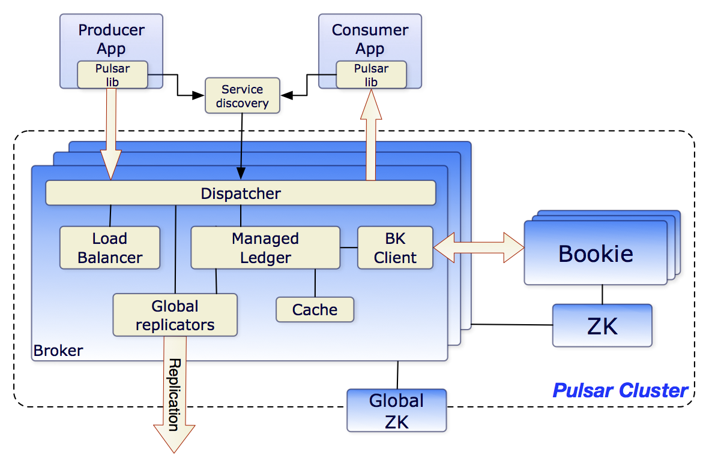

# Pulsar

## Message Attributes

- Value
- Key: Useful for Topic Compaction.
- Properties: A key-value map of user defined properties.
- Producer name
- Topic name
- Schema version: Version number of the message schema.
- Sequence ID: Each message belongs to an ordered sequence on its topic. Can be used for message deduplication.
- Message ID: Assigned by bookies when the message is persisted.
- Publish time: Timestamp when the message is published.
- Event time: Optional timestamp set by the applications.

## Namespace

A namespace is a collection of topics.
One way to use namespaces is to create a namespace per application, and then the application can safely manage its own topics.

## Batching

### Producing

When enabled, the producer collects messages and sends multiple messages in a single request (batch).

## In Queue

Batches are tracked and stored as a single unit rather than individual messages.

## Consuming / Acknowledging

In general batches are acknowledged when all of its messages have been processed. This means that one message failing will cause the retry of all messages in the batch, regardless of wether they were successful.

### Batch Index Acknowledgement

A way to acknowledge individual messages of a batch. This is tracked by the broker. A batch is deleted when all of the batch indexes have been acknowledged.
Must be enabled on broker level and on consumer level.

## Subscriptions

A named configuration that controls how messages are delivered to consumers. There are 4 types:

- `Exclusive`: Only one consumer can use this subscription.
- `Failover`: Multiple consumers can connect, but one is determined to be master and the others are failover.
- `Shared`: Multiple consumers consume at the same time (round robin).
- `Key Shared`: Multiple consumers can consume at the same time, but messages with the same key always go to the same consumer.

## Partitioning

Normal topics are served by a single broker, which limits throughput. A partitioned topic is handled by multiple brokers, meaning higher throughput.
Implemented as multiple normal topics.

### Routing Modes

Routing modes determine which partition a message is published to.

- `RoundRobin`
- `Single`
  - Messages with no keys are all published to the same partition for a given consumer.
  - If the message has a key, the key is hashed and assigned to a partition (there are multiple hashing schemes available).
- `Custom`

### Ordering

The ordering depends on the routing mode:

- Per Key ordering: Single with keys, round robin.
- Per producer: Single with no keys

## System Topics

System topics are topics for internal Pulsar use. They can not be created. See the list: https://pulsar.apache.org/docs/3.1.x/concepts-messaging/#system-topic.

## Re-consuming

### Negative Acknowledgement

Sent by the consumer to force a message to be retried.

- In `exclusive` and `failover` subscription types, you can only acknowledge the last message you receive.
- In `shared` and `key shared` subscription types, you can acknowledge individually.

You can specify custom backoff configuration.

Negative acknowledged messages are cached client side, and do not go to BookKeeper.

### Acknowledgement Timeout

The amount of time to wait before retrying messages that are not acknowledged.

You can specify custom backoff configuration.

### Retry Letter Topic

The retry letter topic is a way to retry messages and have them persisted in BookKeeper. This is more suitable for message which require a large amount of retries with longer delays.

### DLQ

Messages that have failed to be consumed a certain amount of times can move to the DLQ.

Works for unacknowledged and negative acknowledged messages.

## Message Deduplication

An optional feature that prevents the broker from persisting the same message if it has already been persisted.

## Delayed Message Delivery

When you produce a message to Pulsar, you can specify a delay. The message is stored in BookKeeper.

## Message Retention

A Pulsar instance is a collection of Pulsar clusters.



### Pulsar Cluster

A single Pulsar cluster is composed of:

- `A BookKeeper cluster`: Collection of Bookie services that handle persistent storage of messages.
- `A ZooKeeper cluster`: Handles coordination between Pulsar clusters and cluster level config.
- One or more Pulsar brokers

### Persistent vs Non Persistent Topics

- Persistent topics: Persist the messages, ensuring at-least-once delivery.

- Non-persistent topics: Never persisted to disk, messages can be lost.

## Geo Replication

Pulsar supports geo replication by replicating the messages in storage.

### Async

The messages are first persisted to the local cluster and then replicated to remote clusters by the brokers.

### Sync

Data is synced between multiple clusters and the client waits for an acknowledgement.

A synchronous replicated cluster consists of:

- A cluster of Bookies.
- A cluster of brokers.
- A global Zookeeper installation.

### Replication Strategies

#### Full Mesh

Messages are replicated everywhere. You can setup _selective message replication_ to customize replication strategy.

#### Active-Active

A full mesh replication with only two data centers.

#### Aggregation Replication

Front facing data centers replicate to a central aggregated cluster.

## Topic Compaction

Topic compaction is the process of removing older messages which share the same key as newer messages.

Only applies to persistent topics.

Triggered automatically when the backlog reaches a certain size, or can be triggered manually.

## Admin API

The admin API is a rest API exposed by the Pulsar broker. It allows you to manage all aspects of the cluster, including setting up Pulsar functions.

### Examples

`curl --location 'http://localhost:63491/admin/v2/tenants'`

```json
["public", "pulsar"]
```
